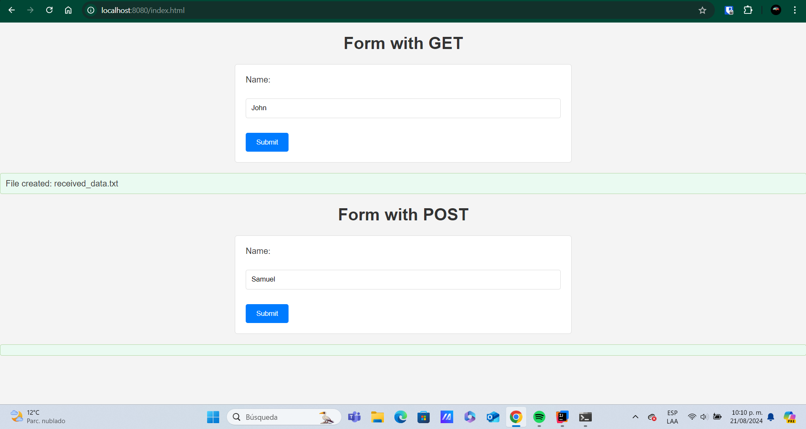
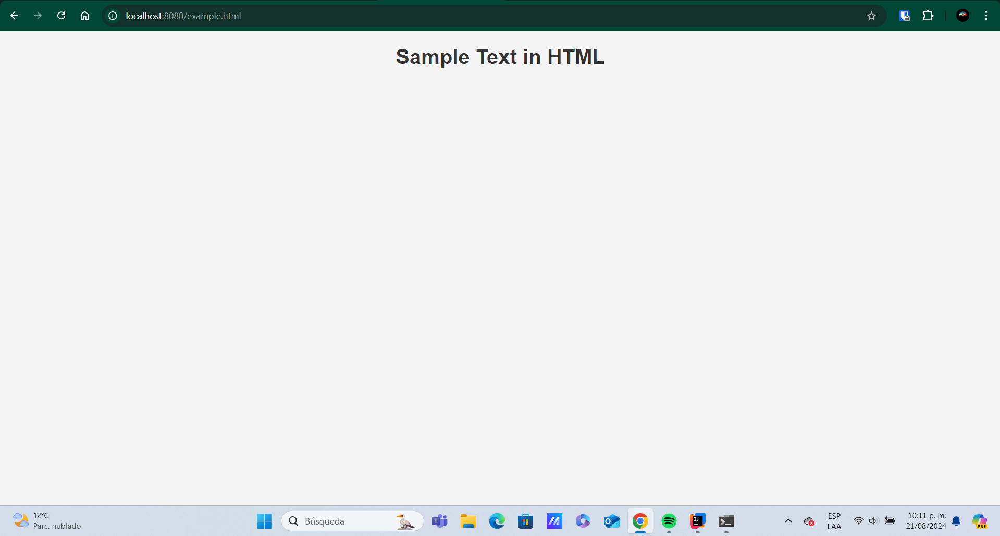
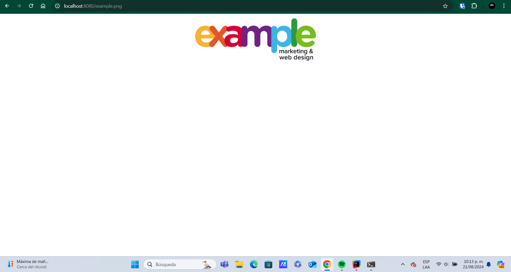
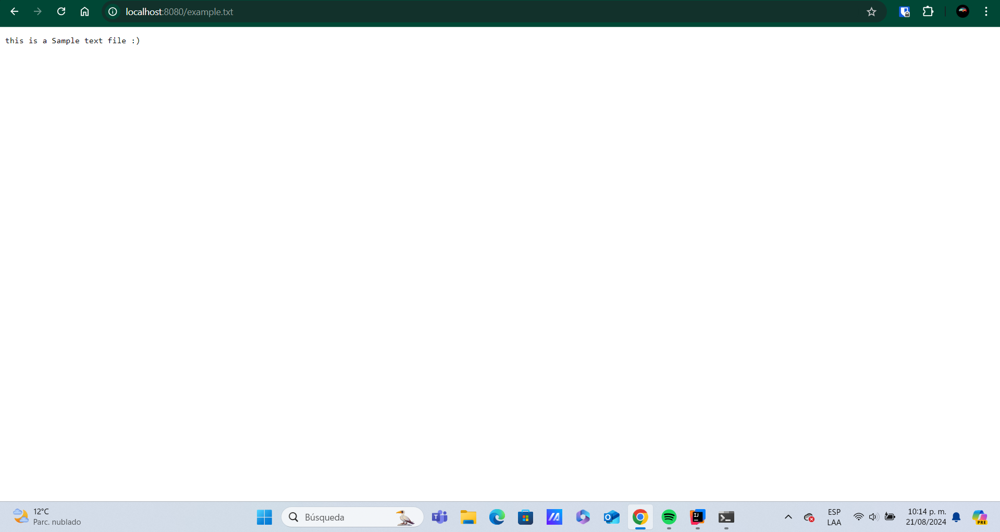

## Overview

### Simple Concurrent Web Server

The Simple Concurrent Web Server is a Java-based HTTP server designed to handle multiple client requests simultaneously using a thread pool. This server is built to serve static files, including HTML, CSS, JavaScript, and images, from a specified directory. It also supports basic REST-like API requests, allowing for the asynchronous communication between the web application and backend services.

### Key Features

- **Concurrent Handling**: Utilizes a fixed-size thread pool to manage multiple client connections concurrently, ensuring efficient request processing.
- **Static File Serving**: Capable of serving a variety of static content such as HTML pages, CSS stylesheets, JavaScript files, and image files (e.g., PNG, JPEG).
- **Basic REST API**: Supports simple REST-like API requests, allowing for dynamic interactions between the client and server.
- **Asynchronous Communication**: Implements asynchronous communication for handling requests and responses, enhancing the responsiveness of the web application.

### Components

1. **Server Initialization**: The server initializes a `ServerSocket` on a specified port and listens for incoming client connections. It uses an `ExecutorService` to manage a fixed number of threads for handling requests concurrently.

2. **Request Handling**:
    - **GET Requests**: The server can serve static files from the designated root directory or return embedded base64-encoded images within HTML responses.
    - **POST Requests**: Handles POST requests by saving request payloads to files and responding with a confirmation message.

3. **File Handling**: Supports reading and serving various file types, including HTML, CSS, JavaScript, and images. The server determines the appropriate content type based on the file extension.

4. **Error Handling**: Responds with appropriate HTTP status codes and error messages for non-existent files or unsupported requests.

## Project Setup

This guide outlines the steps to set up and run your project.

**Prerequisites**

Before proceeding, ensure you have the following software installed on your system:

* **Java** (version 1.8.0 or higher): Download and install Java from the official website: https://www.oracle.com/java/technologies/downloads/
    * Verify your installation by running:
        ```bash
        mvn -version
        ```
      You should see output similar to:

        ```
        Apache Maven 3.x.x (unique identifier)
        Maven home: /path/to/maven
        Java version: 1.8.0, vendor: Oracle Corporation
        Java home: /path/to/java/jdk1.8.0.jdk/Contents/Home
        ...
        ```
* **Git:** Install Git by following the instructions on the official Git website: https://git-scm.com/downloads
    * Verify your installation by running:
        ```bash
        git --version
        ```
      This should output your Git version, for example:

        ```
        git version 2.34.1
        ```

**Installing the Project**

1. **Clone the Repository:**
    ```bash
    git clone [https://github.com/yourusername/your-repo.git](https://github.com/yourusername/your-repo.git) your-repo
    ```
2. **Navigate to the Project Directory:**
    ```bash
    cd Lab1_webserver
    ```

**Building the Project**

1. **Compile and Package:**
    * Run the following command to build the project using Maven:
        ```bash
        mvn package
        ```
    * This will compile your code and create a JAR file in the `target` directory. You should see output similar to:

        ```
        [INFO] Building jar: /path/to/your-repo/target/your-repo-1.0-SNAPSHOT.jar
        [INFO] BUILD SUCCESS
        ```

**Running the Application**

1. **Execute the JAR:**
    * Run the following command to launch your application:
        ```bash
        java java -cp target/arep_lab1-1.0-SNAPSHOT.jar org.example.SimpleWebServer
        ```
   
2. **Expected Output:**
    * You should see a message similar to:

        ```
        Ready to receive on port 8080...
        ```
    * This indicates that your server is running and listening on port 8080.

**Testing**

1. **Open your web browser:**
    * Navigate to `http://localhost:8080/` in your browser.
    * If everything is set up correctly, you should see the content of your `index.html` file or other static files served by the server.
2. **Test Additional Functionality:**
    * Verify other static files and REST endpoints to ensure the server handles them appropriately.

    
## Dependencies
- **Maven**: The project uses Maven to manage dependencies and build the project.
- **JUnit 4**: The project uses JUnit 4 for unit testing.

---------

## Implementation
- Asynchronous App

- Example Html

- Example image .jpg

- Example image .png

- Example Plain Text .txt


## Components

- **SimpleWebServer Class**: This is the main class of the application. It listens for incoming connections on port 8080, creates a thread pool to handle client requests concurrently, and creates a `ClientHandler` object for each accepted connection.

- **ClientHandler Class**: This class implements the `Runnable` interface and represents a worker thread responsible for handling a single client request. It processes the request line, identifies the HTTP method (GET or POST), and delegates the handling to specific methods: `handleGetRequest` or `handlePostRequest`.

- **Static Files**: The application serves static files located in the `WEB_ROOT` directory (default is `src/main/resources`). These files could include HTML, CSS, JavaScript, images, or any other files accessible through a web browser.

## Interaction Flow

### Server Startup
1. The `SimpleWebServer` class starts a `ServerSocket` on port 8080.
2. It creates a fixed thread pool using `Executors.newFixedThreadPool(10)` to handle client requests concurrently.

### Client Connection
1. When a client establishes a connection with the server, the `ServerSocket` accepts it and creates a new `Socket` object.

### Client Request Handling
1. A new `ClientHandler` object is created with the client socket.
2. The `ClientHandler` reads the first line of the request from the input stream.
3. It parses the request line to identify the HTTP method (GET or POST) and the requested file.
4. Based on the method, it calls either `handleGetRequest` or `handlePostRequest`.

#### GET Request Handling
1. The `handleGetRequest` method checks if the requested file exists in the `WEB_ROOT` directory.
2. If the file exists:
    - It determines the content type of the file using the `getContentType` method.
    - If the file is an image (PNG, JPG, JPEG), it reads the image data using `getImageContent` and sends an HTML response with the embedded base64-encoded image.
    - Otherwise, it reads the file data using `readFileData` and sends the file content along with its content type and length in the response header.
3. If the file doesn't exist, it sends a "404 Not Found" response with an error message.

#### POST Request Handling
1. The `handlePostRequest` method reads the incoming data from the client until an empty line is encountered, indicating the end of the header section.
2. It reads the remaining data from the input stream, which represents the POST body.
3. It saves the POST data in a text file named `received_data.txt` within the `WEB_ROOT` directory.
4. It sends a "200 OK" response with a message indicating the file creation.

## Class Descriptions

- **SimpleWebServer**: This class acts as the entry point and manages the overall application flow. It listens for connections, creates worker threads, and delegates request handling to `ClientHandler` objects.

- **ClientHandler**: This class represents a worker thread responsible for processing a single client request. It parses the request line, identifies the HTTP method, and invokes the appropriate methods based on GET or POST requests. It also handles sending responses to the client.

## Relationships Between Classes

- The `SimpleWebServer` class creates instances of the `ClientHandler` class for each incoming client connection.
- The `ClientHandler` class retrieves and processes information from the `SimpleWebServer` class (e.g., `WEB_ROOT` directory) to handle requests. There's a one-to-one relationship between a client connection and a `ClientHandler` object.

----------

## Generating Project Documentation

1. **Generate the Site**
    - Run the following command to generate the site documentation:
      ```sh
      mvn site
      ```

2. **Add Javadoc Plugin for Documentation**
    - Add the Javadoc plugin to the `reporting` section of the `pom.xml`:
      ```xml
      <project>
        ...
        <reporting>
          <plugins>
            <plugin>
              <groupId>org.apache.maven.plugins</groupId>
              <artifactId>maven-javadoc-plugin</artifactId>
              <version>2.10.1</version>
              <configuration>
                ...
              </configuration>
            </plugin>
          </plugins>
        </reporting>
        ...
      </project>
      ```

    - To generate Javadoc as an independent element, add the plugin in the `build` section of the `pom.xml`:
      ```xml
      <project>
        ...
        <build>
          <plugins>
            <plugin>
              <groupId>org.apache.maven.plugins</groupId>
              <artifactId>maven-javadoc-plugin</artifactId>
              <version>2.10.1</version>
              <configuration>
                ...
              </configuration>
            </plugin>
          </plugins>
        </build>
        ...
      </project>
      ```

3. **Generate Javadoc Commands**
    - Use the following commands to generate Javadocs:
      ```sh
      mvn javadoc:javadoc
      mvn javadoc:jar
      mvn javadoc:aggregate
      mvn javadoc:aggregate-jar
      mvn javadoc:test-javadoc
      mvn javadoc:test-jar
      mvn javadoc:test-aggregate
      mvn javadoc:test-aggregate-jar
      ```

---------

## License
This project is licensed under the MIT License - see the [LICENSE](LICENSE.txt) file for details.

----------
## Author
Jose Samuel Mahecha Alarcon